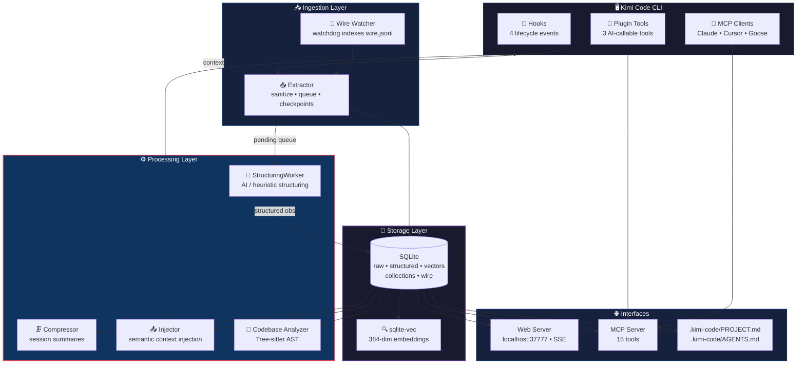

# mneme-kimi-code — Persistent Memory for Kimi Code CLI

[](https://pypi.org/project/mneme-kimi-code/)
[](https://www.python.org/)
[](LICENSE)
[](https://moonshotai.github.io/kimi-cli/)

**Version:** <!-- VERSION -->2.0.24<!-- /VERSION -->

> **Mneme** (Greek: Μνήμη) — the goddess of memory and the mother of the Muses.  
> This project brings persistent, AI-compressed memory to [Kimi Code CLI](https://moonshotai.github.io/kimi-cli/).

**🏷️ Tags:** `kimi-plugin` `kimi-code-cli` `kimi-plugins` `persistent-memory` `ai-memory` `coding-assistant`

---

## Fork-Hinweis

Dieses Repository ist ein **Fork von [`barrelc/kimi-mneme`](https://github.com/barrelc/kimi-mneme)**, angepasst für die neue **Kimi Code CLI**.

Wichtige Unterschiede zum Original:

- **Paketname auf PyPI:** `mneme-kimi-code` (statt `kimi-mneme`)
- **Konfigurationspfad:** `~/.kimi-code/` (statt `~/.kimi/`)
- **Plugin-Installation:** Kimi Code CLI unterstützt `kimi plugin install` **nicht**. Stattdessen werden Lifecycle-Hooks in `~/.kimi-code/config.toml` und der MCP-Server in `~/.kimi-code/mcp.json` registriert.
- **Lizenz:** Das Original steht unter **AGPL-3.0**; dieser Fork bleibt ebenfalls unter **AGPL-3.0**. Siehe [LICENSE](LICENSE) und Abschnitt [Lizenz](#lizenz).

---

## What is mneme-kimi-code?

**mneme-kimi-code** ist ein Plugin für [Kimi Code CLI](https://moonshotai.github.io/kimi-cli/), das persistentes Memory zu deinen Coding-Sessions hinzufügt. Es erfasst Kontext automatisch, komprimiert ihn mit KI und injiziert relevante Beobachtungen in zukünftige Sessions. Nie wieder den Faden verlieren — auch nach Tagen oder Wochen.

### Why mneme-kimi-code?

- **Never lose context** — Deine Coding-Historie überlebt Sessions, Restarts und sogar wochenlange Inaktivität
- **AI-powered memory** — Strukturiert rohe Tool-Outputs in durchsuchbare Beobachtungen
- **Zero configuration** — Funktioniert out-of-the-box mit Kimi Code CLI
- **Privacy-first** — Lokale SQLite-Speicherung; KI-Strukturierung/Kompression sind optional und abschaltbar
- **Cross-platform** — Windows, macOS, Linux

### Offline Behavior & Privacy

mneme-kimi-code ist so konzipiert, dass es **vollständig offline** funktioniert, mit graceful degradation, wenn KI-Services nicht verfügbar sind:

| Feature | Mit API (online) | Ohne API (offline) |
|---------|------------------|---------------------|
| **Observation storage** | ✅ Full | ✅ Full (always local) |
| **Full-text search (FTS5)** | ✅ Full | ✅ Full (local SQLite) |
| **Semantic search (sqlite-vec)** | ✅ Full | ✅ Full (local embeddings) |
| **Session timeline** | ✅ Full | ✅ Full |
| **Context injection** | ✅ Full | ✅ Full (heuristic-based) |
| **AI structuring** | ✅ Rich metadata (type, facts, concepts) | ⚠️ Heuristic fallback (rule-based) |
| **AI compression** | ✅ Semantic summaries | ⚠️ Raw observations stored |
| **Pattern detection** | ✅ AI + heuristic | ⚠️ Heuristic only |
| **Web viewer** | ✅ Full | ✅ Full |
| **MCP tools** | ✅ Full | ✅ Full |

> **Privacy note:** Wenn AI-Strukturierung aktiviert ist, werden Tool-Outputs **nach** Anwendung einer 3-Schicht-Sanitisierung (System-Content entfernt, Secrets redacted, Privacy-Tags entfernt) an den konfigurierten LLM-Provider gesendet. Keine rohen Credentials, Tokens oder `<private>`-Blöcke verlassen deinen Rechner. Für 100% offline-Betrieb ohne Netzwerk-Calls kannst du **Ollama** oder einen anderen lokalen LLM verwenden.

### Who is this for?

- Entwickler, die [Kimi Code CLI](https://moonshotai.github.io/kimi-cli/) nutzen und persistentes Projekt-Memory wollen
- Teams, die an komplexen Codebases über mehrere Sessions arbeiten
- Nutzer des [Moonshot AI](https://moonshot.ai/)-Ökosystems

### Key Features

| Feature | Description |
|---------|-------------|
| 🧠 **Persistent Memory** | Kontext überlebt Sessions, Restarts und Reboots |
| 🤖 **AI Structuring** | Rohe Tool-Outputs → strukturierte Beobachtungen (title, facts, narrative, concepts) via konfigurierbarem LLM (Kimi, Ollama, OpenAI-compatible) |
| ⚡ **Heuristic Fallback** | Funktioniert ohne API-Key — regelbasierte Strukturierung, wenn Kimi nicht verfügbar ist |
| 🔍 **Smart Search** | Volltext- (FTS5) + semantische (sqlite-vec) Hybridsuche über deine Projekt-Historie |
| 📊 **Progressive Disclosure** | 3-Schicht-Retrieval: index → timeline → full details (token-effizient) |
| 🖥️ **Web Viewer** | Echtzeit-Memory-Stream unter `http://localhost:37777` |
| 🔌 **Kimi Plugin Tools** | `mneme_search`, `mneme_timeline`, `mneme_get` — Kimi kann sein eigenes Memory abfragen |
| 🖇️ **MCP Server** | Claude Desktop, Cursor, Goose Integration — 15 Memory-Tools |
| 📝 **PROJECT.md** | Auto-generierter Projekt-Kontext aus strukturierten Beobachtungen |
| 🔒 **Privacy Tags** | 3-Schicht-Filter: System-Content entfernen → Sensitive redacten → Deep-Sanitize (vor jeder KI-Verarbeitung) |
| 📊 **Knowledge Collections** | Kuratiere und query projektspezifische Wissens-Korpora |
| 🌳 **Tree-sitter Analyzer** | AST-basierte Code-Erkundung (Python, JS, TS, Rust, Go) |
| 💰 **Token Economics** | Token-Einsparungen und Read-Cost pro Beobachtung |
| ⚡ **Zero Config** | Installieren und vergessen — funktioniert automatisch |
| 📁 **Project Config** | Pro-Projekt `.mneme.json` für Custom Settings |
| 📌 **Session Checkpoints** | Kontext nach Kimi-CLI-Compaction wiederherstellen |
| 🔁 **Cross-Session Patterns** | Automatische Erkennung wiederkehrender Fehler, Fixes, Entscheidungen |
| ✂️ **Truncation Tracking** | Protokolliert, wenn Tool-Outputs 100K Zeichen überschreiten |

---

## Quick Start

### Prerequisites

- **sqlite3 CLI**: Benötigt für Datenbank-Inspektion und interne Operationen. Installiere via System-Paketmanager (`apt install sqlite3`, `brew install sqlite3`, `winget install SQLite.SQLite`, etc.)

### Installation

Empfohlen wird die Installation mit **`uv`**. `pip` funktioniert als Fallback.

#### Option 1: `uvx` (one-shot, kein dauerhaftes Install)

```bash
uvx --from mneme-kimi-code mneme bootstrap
```

#### Option 2: `uv tool install` (empfohlen — globale Installation)

```bash
uv tool install mneme-kimi-code
mneme bootstrap
```

Updates später:

```bash
uv tool upgrade mneme-kimi-code
mneme bootstrap
```

#### Option 3: `pip` (Fallback)

```bash
pip install mneme-kimi-code
mneme bootstrap
```

Updates später:

```bash
pip install --upgrade mneme-kimi-code
mneme bootstrap
```

> **Hinweis:** `pip install --user` installiert unter `~/.local/bin` (Linux/macOS) oder `%APPDATA%\Python\Scripts` (Windows). Stelle sicher, dass dieses Verzeichnis in deinem `PATH` liegt.

### Host-CLI wählen: Kimi Code CLI **oder** Claude Code

mneme unterstützt **beide** CLIs als Host (dual-target). `mneme bootstrap` erkennt das Ziel automatisch; du kannst es explizit setzen:

```bash
mneme bootstrap --target kimi      # Kimi Code CLI  (~/.kimi-code)
mneme bootstrap --target claude    # Claude Code    (~/.claude)
mneme bootstrap                    # auto-detect
```

Jedes Ziel hat seine **eigene, getrennte Memory-DB** (`~/.kimi-code/mneme/` bzw. `~/.claude/mneme/`), sodass beide CLIs parallel mit voller Feature-Parität laufen können. Das aktive Ziel lässt sich pro Prozess via `MNEME_TARGET=kimi|claude` überschreiben.

| | Kimi Code CLI | Claude Code |
|---|---|---|
| Config-Dir | `~/.kimi-code` | `~/.claude` (bzw. `$CLAUDE_CONFIG_DIR`) |
| Session-Quelle | `sessions/**/wire.jsonl` | `projects/<cwd>/<session>.jsonl` |
| Hook-Registrierung | `config.toml` | `settings.json` (gemerged, Backup) |
| MCP-Registrierung | `~/.kimi-code/mcp.json` | `~/.claude.json` (`mcpServers.mneme`) |
| Skill | `~/.kimi-code/skills/` | `~/.claude/skills/` |
| Lifecycle-Hooks | SessionStart/End, Pre/PostCompact | SessionStart/End, Pre/PostCompact |
| Volle Session-Daten | Wire-Watcher (im Server) | Transcript-Watcher (im Server) |

Für Claude Code werden Tool-Calls, Tool-Outputs, Prompts, Reasoning und Token-Verbrauch aus dem **Transcript** (`~/.claude/projects/.../<session>.jsonl`) gelesen — dieselben strukturierten Beobachtungen wie bei Kimi, ohne Feature-Abstriche.

### Wichtiger Hinweis zu Kimi Code CLI

Die alte `kimi plugin install`-Methode funktioniert **nicht** mit Kimi Code CLI. Die Integration für Kimi Code CLI läuft ausschließlich über:

- **Hooks** in `~/.kimi-code/config.toml` (Lifecycle-Events wie SessionStart, PostToolUse, SessionEnd)
- **MCP-Server** in `~/.kimi-code/mcp.json` (15+ Tools für Claude/Cursor/Goose und Kimi Code CLI selbst)
- **Skill** `mem-search` unter `~/.kimi-code/skills/`

Ein `kimi plugin install`-Schritt ist weder nötig noch möglich. `mneme bootstrap` führt diesen Legacy-Schritt **standardmäßig nicht mehr aus** — die Integration läuft ausschließlich über Hooks und den MCP-Server. Wer den alten Schritt dennoch versuchen will (z. B. mit dem Python-`kimi-cli`), kann ihn mit `--with-plugin` opt-in aktivieren.

### What `bootstrap` does

| Step | What happens |
|------|-------------|
| **Database** | Erstellt SQLite-DB unter `~/.kimi-code/mneme/mneme.db` |
| **Hooks** | Registriert 4 Lifecycle-Hooks in `~/.kimi-code/config.toml` (injiziert Kontext beim Session-Start) |
| **Plugin (legacy)** | Standardmäßig **übersprungen** (funktioniert nicht mit Kimi Code CLI); opt-in via `--with-plugin` |
| **MCP Server** | Registriert `mneme-kimi-code` MCP-Server in `~/.kimi-code/mcp.json` (15+ Tools für Claude/Cursor/Goose) |
| **Skills** | Kopiert den `mem-search`-Skill nach `~/.kimi-code/skills/` (lernt der AI den search→timeline→get-Workflow) |
| **Server** | Startet Web-Dashboard unter `http://localhost:37777` |

> **One command = fully configured.** Kein manuelles Setup nötig.

> **Recommended:** Installiere `sqlite3` CLI für Datenbank-Inspektion und interne Operationen:
> ```bash
> # Linux (Debian/Ubuntu)
> apt install sqlite3
>
> # macOS
> brew install sqlite3
>
> # Windows
> winget install SQLite.SQLite
> ```

### Use Kimi Code CLI normally

```bash
kimi
```

Das war's. Jede Session wird automatisch erfasst und indiziert. Wenn du eine neue Session in einem Projekt startest, wird vorheriger Kontext automatisch injiziert.

### Out-of-Box Experience

Nach `mneme bootstrap` funktioniert alles automatisch:

1. **Auto-injected context** bei jedem `kimi`-Start — zeigt "What we did before" mit echten Prompts, Dateien und Tools
2. **MCP tools** — 15+ Tools inklusive `memory_search`, `memory_semantic_search`, `smart_search`, `smart_outline`
3. **Skills** — Kimi lernt den 3-Layer-Workflow: search → timeline → get (10x Token-Einsparung)
4. **Web UI** — Timeline durchsuchen unter `http://localhost:37777`

> 💡 **Frag Kimi:** *"What did we do yesterday?"* oder *"Search my memory for the auth bug"* — es werden die Memory-Tools automatisch genutzt.

---

## Next Steps

Nach der Installation solltest du folgendes prüfen bzw. anpassen:

1. **API-Key / LLM-Provider:** Falls du nicht den Standard-Provider nutzen möchtest, setze in `~/.kimi-code/mneme/config.json` oder via Umgebungsvariablen:
   - `MNEME_LLM_PROVIDER` (`kimi`, `ollama`, `openai_compatible`)
   - `MNEME_LLM_MODEL` (z. B. `kimi-k2.5`)
   - `MNEME_LLM_API_KEY`
   - `MNEME_LLM_BASE_URL` (für eigene/self-hosted Endpunkte)
2. **Server-URL:** Standard ist `http://127.0.0.1:37777`. Änderbar via `MNEME_SERVER_HOST` und `MNEME_SERVER_PORT`.
3. **Datenbank- & Vektor-Pfade:** Standard unter `~/.kimi-code/mneme/`. Änderbar via `MNEME_DB_PATH` und `MNEME_VECTOR_PATH`.
4. **Privacy-Excludes:** Passe in `config.json` oder `.mneme.json` die `privacy.exclude_patterns` an, damit Secrets/Keys niemals gespeichert werden.
5. **Installation verifizieren:**
   ```bash
   mneme stats
   curl http://localhost:37777/api/health
   ```

---

## 🧩 Kimi Plugin Ecosystem

**mneme-kimi-code** ist Teil des wachsenden [Kimi Code CLI](https://moonshotai.github.io/kimi-cli/)-Plugin-Ökosystems. Das Projekt erweitert Kimi Code CLI um:

- **Persistent Memory** — Kontext überlebt Sessions
- **AI Tools** — `mneme_search`, `mneme_timeline`, `mneme_get` aufrufbar durch Kimi AI
- **Web Dashboard** — Echtzeit-Memory-Viewer unter `localhost:37777`
- **MCP Server** — Integration mit Claude Desktop, Cursor, Goose

> 🔍 **Search terms:** `kimi plugin`, `kimi code cli plugin`, `kimi plugins`, `kimi memory`, `kimi persistent memory`, `moonshot ai plugin`

### Search your memory

Innerhalb von Kimi Code CLI kann die AI dein Memory durchsuchen:

```
> Search my memory for the auth bug we fixed last week
```

Oder nutze den Web-Viewer:

```bash
open http://localhost:37777
```

---

## Architecture Overview



### Components

| Component | Purpose |
|-----------|-------------|
| **Hooks** | 4 Lifecycle-Hooks (SessionStart, SessionEnd, PreCompact, PostCompact); Tool-/Prompt-Daten kommen aus dem Wire-Watcher |
| **Plugin** | 3 AI-aufrufbare Tools: `mneme_search`, `mneme_timeline`, `mneme_get` |
| **Wire Watcher** | watchdog-basiertes Indexieren von Kimi CLI `wire.jsonl` + `state.json` |
| **Extractor** | Sanitisiert Beobachtungen, fügt zur Pending-Queue hinzu, erstellt Checkpoints, erkennt Patterns |
| **StructuringWorker** | Background-Worker: AI-Strukturierung (Kimi/Ollama/OpenAI) → heuristic fallback |
| **Compressor** | Generiert Session-Summaries via konfigurierbarem LLM |
| **Injector** | Injiziert strukturierten Kontext + semantische Suchergebnisse beim Session-Start |
| **Codebase Analyzer** | Tree-sitter AST-Analyse (Python, JS, TS, Rust, Go) — scan, search, outline |
| **SQLite** | Raw observations, structured observations, vectors, collections, wire events |
| **sqlite-vec** | 384-dim Embeddings für semantische Ähnlichkeitssuche (primary, cross-platform) |
| **Web Server** | FastAPI + vanilla JS auf Port 37777 — SSE stream, structured cards, search |
| **MCP Server** | 15 Tools für Claude Desktop, Cursor, Goose — search, timeline, collections, codebase |

---

## CLI Commands

```bash
mneme bootstrap          # One-shot setup (hooks, MCP, DB, server)
mneme update             # Update hooks and config to latest version
mneme server             # Start web server
mneme init               # Initialize database only
mneme stats              # Show database statistics
mneme cleanup --days 30  # Remove old observations
```

---

## Per-Project Configuration

Erstelle `.mneme.json` im Projekt-Root:

```json
{
  "injection": {
    "max_tokens": 1000,
    "recency_boost_days": 14,
    "include_patterns": true
  },
  "privacy": {
    "exclude_patterns": ["*.local.env", "secrets/"]
  }
}
```

Dies merged mit der globalen Config (Projekt-Werte überschreiben globale).

---

## Documentation

- [Installation Guide](docs/INSTALL.md) — Detailliertes Setup und Konfiguration
- [Architecture](docs/ARCHITECTURE.md) — Deep Dive in System-Design
- [Hooks Reference](docs/HOOKS.md) — Alle 7 Lifecycle-Events erklärt
- [Plugin Tools](docs/TOOLS.md) — Wie die AI Memory abfragt
- [Web UI](docs/WEB_UI.md) — Nutzung des Memory-Viewers
- [Configuration](docs/CONFIG.md) — Settings und Umgebungsvariablen
- [Privacy](docs/PRIVACY.md) — Ausschluss sensibler Daten
- [Development](docs/DEVELOPMENT.md) — Mitwirken und Hacken

---

## Requirements

- **Python**: 3.10+
- **Kimi Code CLI**: 1.41+
- **sqlite3 CLI**: Benötigt für Datenbank-Inspektion und interne Operationen. Installiere via System-Paketmanager (`apt install sqlite3`, `brew install sqlite3`, `winget install SQLite.SQLite`, etc.)
- **OS**: Windows, macOS, Linux
- **Optional**: Kein API-Key für Kimi nötig — verwendet den Kimi CLI OAuth-Token. Alternativ Ollama/OpenAI-compatible für lokale/self-hosted LLMs. AI-Strukturierung/Kompression fallen graceful auf heuristic mode zurück, wenn offline.

---

## Lizenz

Dieser Fork wird unter der **[GNU Affero General Public License v3.0 (AGPL-3.0)](LICENSE)** veröffentlicht — dieselben Lizenzbedingungen wie das Original [`barrelc/kimi-mneme`](https://github.com/barrelc/kimi-mneme).

Copyright (C) 2026 mneme-kimi-code contributors.

This project is free software: you can redistribute it and/or modify
it under the terms of the GNU Affero General Public License as published by
the Free Software Foundation, either version 3 of the License, or
(at your option) any later version.

> **Hinweis zum Fork:** Dieses Projekt basiert auf dem Original `kimi-mneme` von `barrelc/kimi-mneme`, das unter AGPL-3.0 veröffentlicht ist. Alle Änderungen für Kimi Code CLI (neue `.kimi-code`-Pfade, Paketname `mneme-kimi-code`, MCP-/Hook-Registrierung) unterliegen ebenfalls AGPL-3.0.

---

## Acknowledgments

Inspiriert durch das Konzept persistenter KI-Memory. Gebaut für das Kimi Code CLI-Ökosystem mit Liebe für Open-Source-Tools. Basierend auf [`barrelc/kimi-mneme`](https://github.com/barrelc/kimi-mneme).

> *"Memory is the scribe of the soul."* — Aristotle
